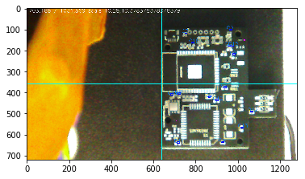

```python
import cv2
import numpy as np
import serial
import time
from matplotlib import pyplot as plt
%matplotlib inline
print(cv2.__version__)

dispW=1280
dispH=720
cam0=cv2.VideoCapture('/dev/video1')
cam0.set(cv2.CAP_PROP_FRAME_WIDTH,dispW)
cam0.set(cv2.CAP_PROP_FRAME_HEIGHT,dispH)
ret, frame0 = cam0.read()
cv2.imshow('PCB',frame0)

```

    4.1.1


```python
# fiducials on screen
fid1_x = 704
fid1_y = 187
fid2_x = 1036
fid2_y = 562

scale_x=10.34
scale_y=10.24


parts=[ ['C2', '100n','C0402K' ,(21.990178125,  23.108028125),   0],
        ['C3', '10uF','C0603K' ,(29.1983125,    27.4106625),     0],
        ['C4', '100n','C0402K' ,(28.05265,       2.2391375) ,    0],
        ['C5', '10uF','C0603K' ,(30.8694125,    46.368465625) ,270],
        ['C6', '10uF','C0603K' ,(33.211415625,  42.55428125) ,  90],
        ['C7', '100n','C0402K' ,(11.061953125,  52.302534375),   0],
        ['C8', '10uF','C0603K'  ,(7.7800625,    24.5341875) ,  180],
        ['C9', '100n','C0402K' ,(31.749109375,  53.6947125) ,  180],
        ['C12','10uF','C0603K', (25.40203125,   21.5306875) ,    0],
        ['C13','10uF','C0603K', (36.848028125,   8.94283125) ,  90],
        ['C14','10uF','C0603K',  (7.4752125,     2.067684375) ,  0],
        ['C15','10uF','C0603K', (32.506915625,  46.366940625) , 90],
        ['C16','10uF','C0603K', (14.278353125,  47.813975) ,   180],
        ['C18','10uF','C0603K',  (4.498853125 , 24.129871875) ,270],
        ['D12', 'red','C0603'  ,(41.48366875 ,  16.2085) ,     270]]
fiducial= [(6,13),(38,50)]


```


```python
def fadenkreuz(myimg):
    cv2.line(img=myimg, pt1=(0, 360),   pt2=(1280, 360), color=(0, 255, 255), thickness = 1, lineType = 8, shift = 0)
    cv2.line(img=myimg, pt1=(640, 0),   pt2=(640, 720), color=(0, 255, 255), thickness = 1, lineType = 8, shift = 0)
def draw_part(myimg,p):
    global scale_x,scale_y,fid1_x,fid1_y,fiducial
    x = int(        ( p[3][0] - fiducial[0][0] ) * scale_x   + fid1_x )
    # TODO: check for 340 ?!?!?!
    y = int( 340 - (( p[3][1] - fiducial[0][1] ) * scale_y ) + fid1_y)
    cv2.rectangle(myimg, (x-6,y-3), (x+6,y+3), (0,0,255), 2)
    cv2.putText(myimg, p[0] , (x-20,y), cv2.FONT_HERSHEY_SIMPLEX, 0.8, (0,128,255), 1, cv2.LINE_AA)
def draw_fiducial(myimg):
    global fid1_x,fid1_y,fid2_x,fid2_y
    cv2.rectangle(myimg, (fid1_x-4,720-fid1_y-2), (fid1_x+4,720-fid1_y+2), (255,0,255), 2)
    cv2.rectangle(myimg, (fid2_x-4,720-fid2_y-2), (fid2_x+4,720-fid2_y+2), (255,0,255), 2)


fiducial_klick = False
def on_mouse_click(event, x, y, flags, param):
    global fid1_x,fid1_y,fid2_x,fid2_y,fiducial_klick,fiducial,scale_x,scale_y
    if event == cv2.EVENT_LBUTTONUP:
        fiducial_klick= not fiducial_klick
        if(fiducial_klick):
            fid1_x = x
            fid1_y = 720-y
            print('fid1 set',fid1_x,fid1_y)  
        else:
            fid2_x = x
            fid2_y = 720-y
            print('fid2 set',fid2_x,fid2_y)  
        scale_x = abs(fid2_x-fid1_x) / abs(fiducial[1][0] - fiducial[0][0])
        scale_y = abs(fid2_y-fid1_y) / abs(fiducial[1][1] - fiducial[0][1])

def mapPoint(x,y):
    global fid1_x,fid1_y,fid2_x,fid2_y
    nx=x
    ny=y
    return (ny,ny)
   
    
```


```python
cv2.setMouseCallback("PCB", on_mouse_click)
while True:
    ret, frame0 = cam0.read()
    fadenkreuz(frame0)
    for p in parts:
        draw_part(frame0,p)
    cv2.putText(frame0, str(fid1_x)+','+ str(fid1_y)+' / '+ str(fid2_x)+','+ str(fid2_y)+
                 ' scale '+ str(scale_x)+','+ str(scale_y),
                 (10,20), cv2.FONT_HERSHEY_SIMPLEX, 0.8, (255,255,255), 1, cv2.LINE_AA)
    draw_fiducial(frame0)
    cv2.imshow('PCB',frame0)
    mykey = cv2.waitKey(1)
    if(mykey == ord('q')):
        break
    if(mykey == ord('p')):
        plt.imshow(frame0)
        plt.show()
cam0.release()
cv2.destroyWindow('PCB')
```

    fid1 set 703 185
    fid2 set 1031 569





```python

```
